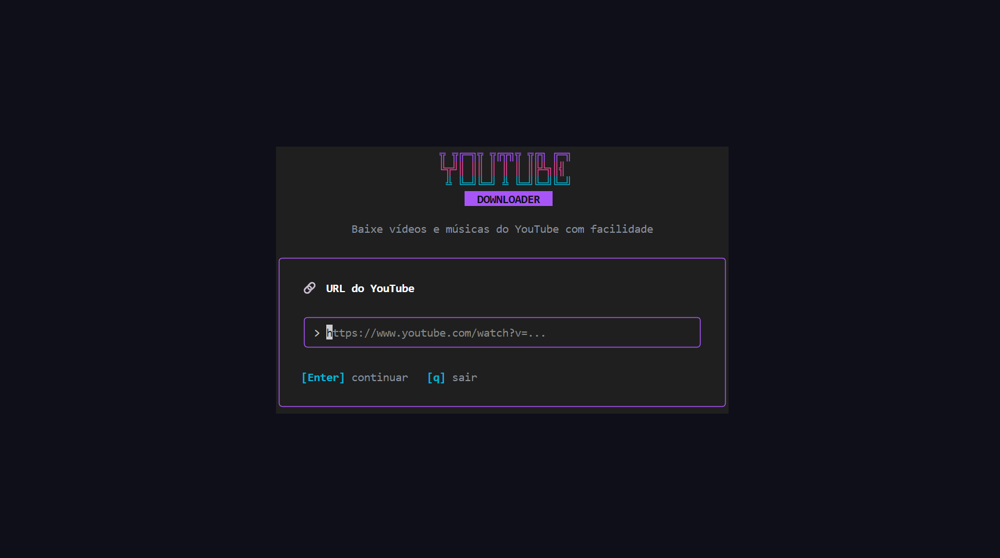

# YouTube Downloader

Um downloader TUI moderno para YouTube, escrito em Go.



## Funcionalidades

- **MP3** — Extrair áudio em 128, 192, 256 ou 320 kbps
- **MP4** — Baixar vídeos em 360p, 480p, 720p, 1080p, 1440p ou 4K (2160p)
- Interface TUI com navegação por teclado
- Logs em tempo real do progresso do download
- Arquivos salvos na pasta `downloads/` ao lado do executável

## Dependências

### yt-dlp (obrigatório)
```powershell
winget install yt-dlp
```
Ou baixe em [github.com/yt-dlp/yt-dlp/releases](https://github.com/yt-dlp/yt-dlp/releases)

### ffmpeg (necessário para MP3 e fusão de vídeo/áudio)
```powershell
winget install ffmpeg
```

## Uso

```powershell
.\yt-downloader.exe
```

### Controles

| Tecla        | Ação              |
|--------------|-------------------|
| `↑` / `↓`   | Navegar           |
| `Enter`      | Confirmar         |
| `Esc`        | Voltar            |
| `r`          | Reiniciar         |
| `q` / Ctrl+C | Sair              |

## Compilar

```powershell
go build -ldflags="-s -w" -o yt-downloader.exe ./cmd/
```
